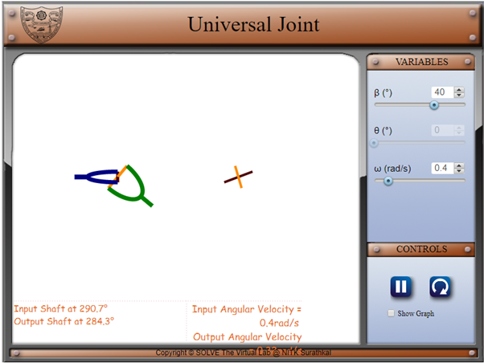
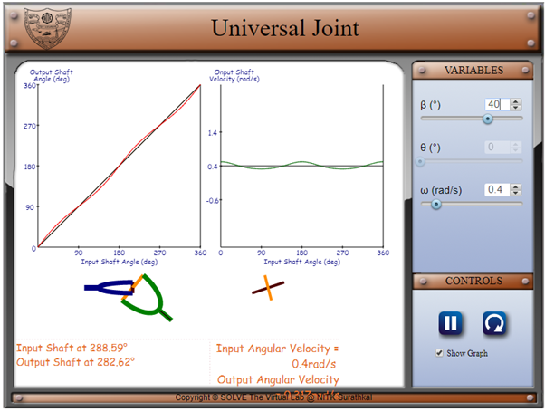

## Objective:

- To understand the relative motion between the output and the input shaft of the universal joint.
- To understand the variation of angle output shaft and input shaft.</li>

## Steps:

1. In the beginning two shafts are rotating, output shaft has the inclination 400 and input shaft has the angular velocity 0.4 rad/s.

2. Change the values of β and ω and can check the results in main screen.
   Click on the show graph you can see the graph between input shaft angle vs output shaft angle, input shaft angle vs output shaft velocity.

