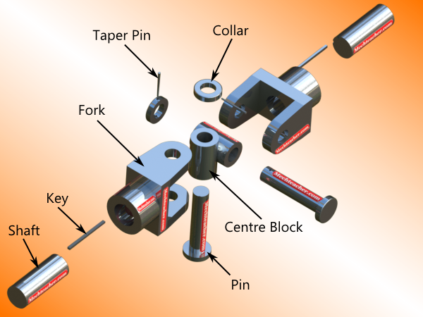
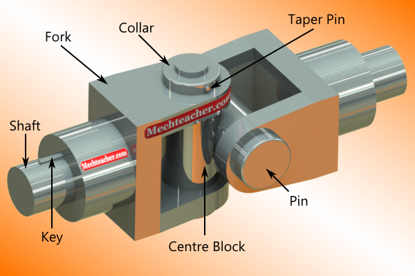
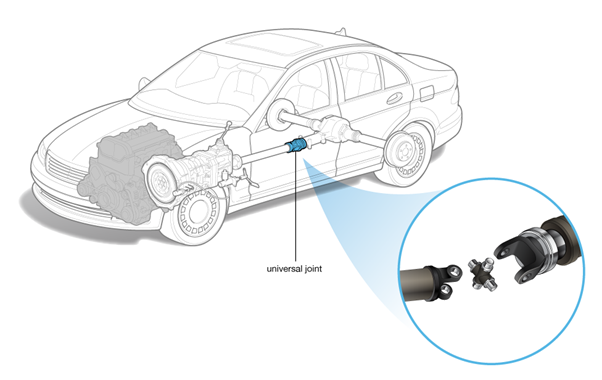
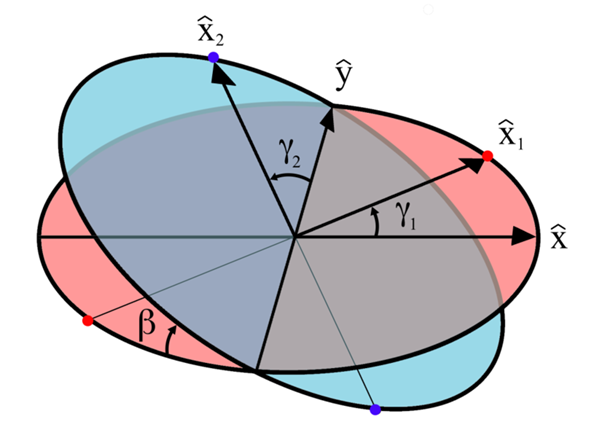
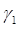
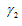
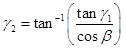
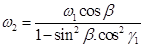

## Objective

After completing the simulation experiments on balancing of multiple masses in single plane one should be able to
1. To understand the relative motion between the output and the input shaft of the universal joint.
2. To understand the variation of angle output shaft and input shaft.

## Introduction:

Universal joint is a positive mechanical joint used for connecting shafts, whose axes are inclined at an angle to each other. It is also known as universal coupling, U-joint, Cardan Joint and Hooke’s Joint. It compensates angular misalignment between the shafts in any direction.

A universal joint is a joint or coupling in a rigid rod that allows the rod to 'bend' in any direction and is commonly used in shafts that transmit rotary motion. It consists of a pair of hinges located close together, oriented at 90° to each other, connected by a cross shaft. It is not a constant velocity joint. The universal joint suffers from one major problem: even when the input drive shaft axle rotates at a constant speed, the output drive shaft axle rotates at a variable speed, thus causing vibration and wear.

You can understand the parts of a universal coupling clearly by taking a look at the exploded view shown below. To know more about the parts.

Fig: Exploded view of a Universal Joint

The two fork ends are assembled co-axially with respect to the centre block. The pins are assembled into the holes provided in the fork end. They are held in position by means of a collar and a collar pin. The assembled view of a universal joint is shown below. For a detailed understanding of the assembly of a typical universal joint.
Impact testing machine consists of a pendulum suspended from a short shaft that rotates in ball bearing and swings midway between two rigid upright stands supported on a rigid base near the bottom of which are the specimen supports anvils. The knife-edge or striking edge is slightly rounded. The pendulum can be raised to any desired height and rested at that position. It is supported in the starting position by a catch and can be released by a trigger. The mechanism is so designed that the pendulum is not disturbed when the catch is released.

Fig: Assembled View

Universal joint has a wide range of applications. It is used in:
* Driveshafts
* Automobile propeller shafts
* Stone crusher
* Tapping machinery
* Centrifugal blowers
* Centrifugal fans and centrifugal pumps
* Belt conveyors
* Control mechanisms
* Marine equipment
* Metal forming machinery
* Sockets

The figure given below showing in the car universal joint connected to propeller shaft for transmitting the power.

Fig: Universal joint in the car

## MATHEMATICAL EQUATIONS

The variation in the speed of the driven shaft depends on the configuration of the joint, which is specified by three variables:

*  = The angle of rotation for axle 1
*  = The angle of rotation for axle 2
*  = The bend angle of the joint

The angular position of the rotation axle 2 is given by: 

The angular velocity of the rotation axle 2 is given by: 

